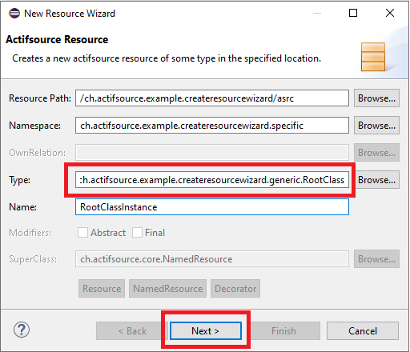

# New Resource Wizard Page
In this project we will show how to add additional fields to the new resource wizard.

## New Resource Wizard

## Requirements
Actifsource Workbench Enterprise Edition

## License
[http://www.actifsource.com/company/license](http://www.actifsource.com/company/license)
